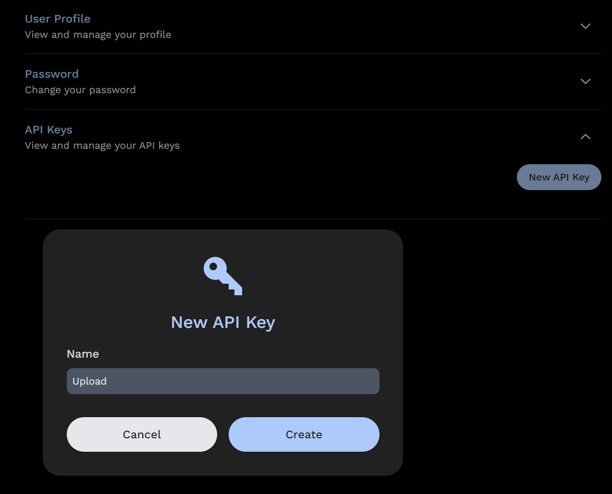

# Bulk Upload (Using the CLI)

You can use the CLI to upload an existing gallery to the Immich server

[Immich CLI Repository](https://github.com/immich-app/CLI)

:::tip Google Photos Takeout
If you are looking to import your Google Photos takeout, we recommed this community maintained tool [immich-go](https://github.com/simulot/immich-go)
:::

## Requirements

- Node.js 16 or above
- Npm

## Installation

```bash
npm i -g immich
```

Pre-installed on the `immich-server` container and can be easily accessed through

```
immich
```

### Options

| Parameter        | Description                                                         |
| ---------------- | ------------------------------------------------------------------- |
| --yes / -y       | Assume yes on all interactive prompts                               |
| --recursive / -r | Include subfolders                                                  |
| --delete / -da   | Delete local assets after upload                                    |
| --key / -k       | User's API key                                                      |
| --server / -s    | Immich's server address                                             |
| --threads / -t   | Number of threads to use (Default 5)                                |
| --album/ -al     | Create albums for assets based on the parent folder or a given name |

## Quick Start

Specify user's credential, Immich's server address and port and the directory you would like to upload videos/photos from.

```
immich upload --key HFEJ38DNSDUEG --server http://192.168.1.216:2283/api file1.jpg file2.jpg
```

By default, subfolders are not included. To upload a directory including subfolder, use the --recursive option:

```
immich upload --key HFEJ38DNSDUEG --server http://192.168.1.216:2283/api --recursive directory/
```

### Obtain the API Key

The API key can be obtained in the user setting panel on the web interface.



---

### Run via Docker

You can run the CLI inside of a docker container to avoid needing to install anything.

:::caution Running inside Docker
Be aware that as this runs inside a container, you need to mount the folder from which you want to import into the container.
:::

```bash title="Upload current directory"
cd /DIRECTORY/WITH/IMAGES
docker run -it --rm -v "$(pwd):/import" ghcr.io/immich-app/immich-cli:latest upload --recursive --key HFEJ38DNSDUEG --server http://192.168.1.216:2283/api
```

```bash title="Upload target directory"
docker run -it --rm -v "/DIRECTORY/WITH/IMAGES:/import" ghcr.io/immich-app/immich-cli:latest upload --recursive --key HFEJ38DNSDUEG --server http://192.168.1.216:2283/api
```

```bash title="Create an alias"
alias immich='docker run -it --rm -v "$(pwd):/import" ghcr.io/immich-app/immich-cli:latest'
immich upload --recursive --key HFEJ38DNSDUEG --server http://192.168.1.216:2283/api
```

:::tip Internal networking
If you are running the CLI container on the same machine as your Immich server, you may not be able to reach the external address. In that case, try the following steps:

1. Find the internal Docker network used by Immich via `docker network ls`.
2. Adapt the above command to pass the `--network <immich_network>` argument to `docker run`, substituting `<immich_network>` with the result from step 1.
3. Use `--server http://immich-server:3001` for the upload command instead of the external address.

```bash title="Upload to internal address"
docker run --network immich_default -it --rm -v "$(pwd):/import" ghcr.io/immich-app/immich-cli:latest upload --recursive --key HFEJ38DNSDUEG --server http://immich-server:3001
```

:::

### Run from source

```bash title="Clone Repository"
git clone https://github.com/immich-app/CLI
```

```bash title="Install dependencies"
npm install
```

```bash title="Build the project"
npm run build
```

```bash title="Run the command"
node bin/index.js upload --key HFEJ38DNSDUEG --server http://192.168.1.216:2283/api --recursive your/asset/directory
```
