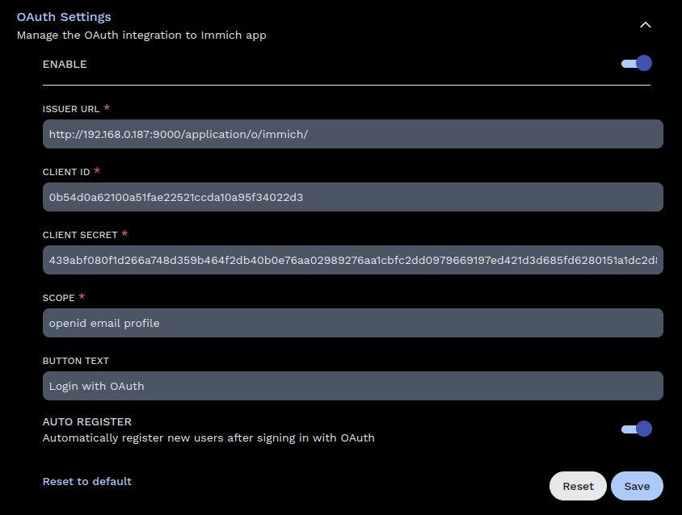

# OAuth Authentication

This page contains details about using OAuth in Immich.

## Overview

Immich supports 3rd party authentication via [OpenID Connect][oidc] (OIDC), an identity layer built on top of OAuth2. OIDC is supported by most identity providers, including:

- [Authentik](https://goauthentik.io/integrations/sources/oauth/#openid-connect)
- [Authelia](https://www.authelia.com/configuration/identity-providers/open-id-connect/)
- [Okta](https://www.okta.com/openid-connect/)
- [Google](https://developers.google.com/identity/openid-connect/openid-connect)

## Prerequisites

Before enabling OAuth in Immich, a new client application needs to be configured in the 3rd-party authentication server. While the specifics of this setup vary from provider to provider, the general approach should be the same.

1. Create a new (Client) Application

   1. The **Provider** type should be `OpenID Connect` or `OAuth2`
   2. The **Client type** should be `Confidential`
   3. The **Application** type should be `Web`
   4. The **Grant** type should be `Authorization Code`

2. Configure Redirect URIs/Origins

The **Sign-in redirect URIs** should include:

- All URLs that will be used to access the login page of the Immich web client (eg. `http://localhost:2283/auth/login`, `http://192.168.0.200:2283/auth/login`, `https://immich.example.com/auth/login`)
- Mobile app redirect URL `app.immich:/`

:::caution
You **MUST** include `app.immich:/` as the redirect URI for iOS and Android mobile app to work properly.

**Authentik example**

:::

## Enable OAuth

Once you have a new OAuth client application configured, Immich can be configured using the Administration Settings page, available on the web (Administration -> Settings).

| Setting       | Type    | Default              | Description                                                               |
| ------------- | ------- | -------------------- | ------------------------------------------------------------------------- |
| Enabled       | boolean | false                | Enable/disable OAuth                                                     |
| Issuer URL    | URL     | (required)           | Required. Self-discovery URL for client (from previous step)              |
| Client ID     | string  | (required)           | Required. Client ID (from previous step)                                  |
| Client secret | string  | (required)           | Required. Client Secret (previous step)                                   |
| Scope         | string  | openid email profile | Full list of scopes to send with the request (space delimited)            |
| Button text   | string  | Login with OAuth     | Text for the OAuth button on the web                                      |
| Auto register | boolean | true                 | When true, will automatically register a user the first time they sign in |

:::info
The Issuer URL should look something like the following, and return a valid json document.

- `https://accounts.google.com/.well-known/openid-configuration`
- `http://localhost:9000/application/o/immich/.well-known/openid-configuration`

The `.well-known/openid-configuration` part of the url is optional and will be automatically added during discovery.
:::

Here's an example of OAuth configured for Authentik:

[oidc]: https://openid.net/connect/
